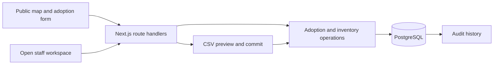

# Van Cortlandt Park — Bench Adoption

A demo application with a public bench registry and an open staff workspace. PostgreSQL as single source of truth for inventory, donors, and adoption periods.

**This is a demonstration, not the park's live adoption system.** The seed contains 520 fictional bench locations and fictional donor records. Only the park boundary and area polygons come from official NYC Parks data. No payments or emails are sent.

## Structure

```text
src/app/                  Pages, layouts, and thin HTTP route handlers
src/features/
  benches/                Public queries, registry, detail screen, map, geography
  adoptions/              Calendar rules, validation, transactional adoption operations
  management/             Staff tables, editor, inventory/contact operations
  imports/                CSV parsing, preview/commit transaction, import screen
  shared/                 Error handling, request boundaries, small UI primitives
src/db/                   Drizzle schema and PostgreSQL connection pool
drizzle/                  Versioned SQL migrations, including the overlap constraint
scripts/                  Migrate, seed, refresh geography
tests/                    Unit, real-database integration, and browser tests
```



The core records are **bench**, **donor**, and **adoption**. A donor can adopt multiple benches over time; a bench can have many historical adoptions. Public credit belongs to each adoption, so changing a contact's name does not silently rewrite earlier dedications. Bench codes are permanent identifiers. Cancellation and retirement preserve records instead of deleting them.

## Geography sources

The checked-in geometry was retrieved from [NYC Parks Properties](https://data.cityofnewyork.us/Recreation/Parks-Properties/enfh-gkve) and [NYC Parks Zones](https://data.cityofnewyork.us/City-Government/Parks-Zones/4j29-i5ry), filtered to `gispropnum='X092' AND retired=false`.

The map credits [OpenStreetMap contributors](https://www.openstreetmap.org/copyright).
